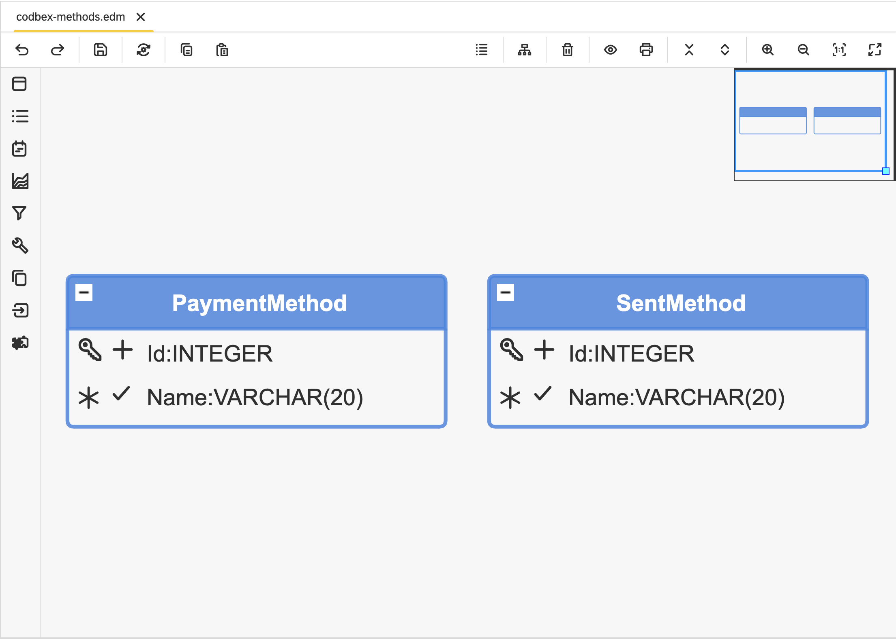

#  codbex-methods

## 📖 Table of Contents
* [🗺️ Entity Data Model (EDM)](#️-entity-data-model-edm)
* [🧩 Core Entities](#-core-entities)
* [🔗 Sample Data Modules](#-sample-data-modules)
* [🐳 Local Development with Docker](#-local-development-with-docker)

## 🗺️ Entity Data Model (EDM)



## 🧩 Core Entities

### Entity: `PaymentMethod`

| Field              | Type     | Details                      | Description                              |
| ------------------ | -------- |------------------------------| ---------------------------------------- |
| Id  | INTEGER  | PK, Identity       | Unique identifier for the payment method. |
| Name | VARCHAR  | Length: 20, Unique, Not null | Name of the payment method.              |

### Entity: `SentMethod`

| Field            | Type     | Details                      | Description                              |
| ---------------- | -------- |------------------------------| ---------------------------------------- |
| Id  | INTEGER  | PK, Identity       | Unique identifier for the sent method.   |
| Name | VARCHAR  | Length: 20, Unique, Not null | Name of the sent method.                 |

## 🔗 Sample Data Modules

- [codbex-methods-data](https://github.com/codbex/codbex-methods-data)

## 🐳 Local Development with Docker

When running this project inside the codbex Atlas Docker image, you must provide authentication for installing dependencies from GitHub Packages.
1. Create a GitHub Personal Access Token (PAT) with `read:packages` scope.
2. Pass `NPM_TOKEN` to the Docker container:

    ```
    docker run \
    -e NPM_TOKEN=<your_github_token> \
    --rm -p 80:80 \
    ghcr.io/codbex/codbex-atlas:latest
    ```

⚠️ **Notes**
- The `NPM_TOKEN` must be available at container runtime.
- This is required even for public packages hosted on GitHub Packages.
- Never bake the token into the Docker image or commit it to source control.
